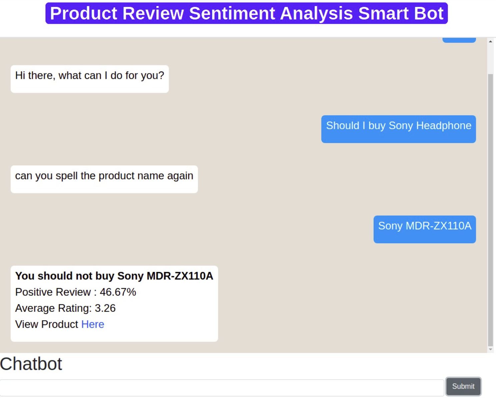

# Product Review Sentiment Analysis with SmartBot Using Natural Language Processing

## Introduction
Chatbot that will help users to have opinion on weather they should buy this product or not based on sentiment analysis of reviews on that product.

for more info visit [Docs](Docs) 

## Result 

## TechStack

- Python
- Pytorch ( For Chatbot)
- Flask ( For webapp )
- beautifulsoup ( For webscrap) 

## Setup and Run

1. Create virtual environment

2. Install dependecies

        pip install -r requirements.txt

3. Run 

         flask run 

## Refrences 

1.  https://github.com/python-engineer/pytorch-chatbot
1.  https://www.pingshiuanchua.com/blog/post/scraping-search-results-from-google-search
1.  https://www.arxiv-vanity.com/papers/1608.04670/ 
1.  https://www.youtube.com/watch?v=RpWeNzfSUHw
